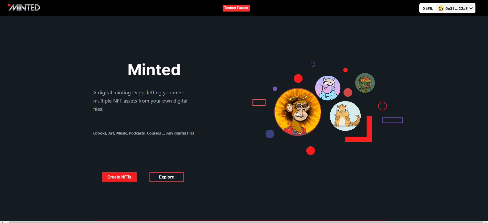

# Filecoin / EthOnline FEVM Hackathon 

This project allows users to mint multiple copies of their NFTS on the Wallaby testnet of FEVM using ERC1155 standards contract.

Web3Storage is used to store media and metadata to IPFS.

Ethers.js is used to interact with the contract on FEVM.

Using rainbow wallet to connect users.

With help from Mentors in discord I was able to change the openzeppelin ERC1155 contract to work on FEVM
https://fvm-forum.filecoin.io/t/cannot-invoke-extcodesize-for-non-evm-actor/115/3?u=raul

Deployed contract address 0xf76D167A96Fff3526918aad94e2963Bf772444ad
https://explorer.glif.io/address/0xf76D167A96Fff3526918aad94e2963Bf772444ad/?network=wallaby

## Minted

